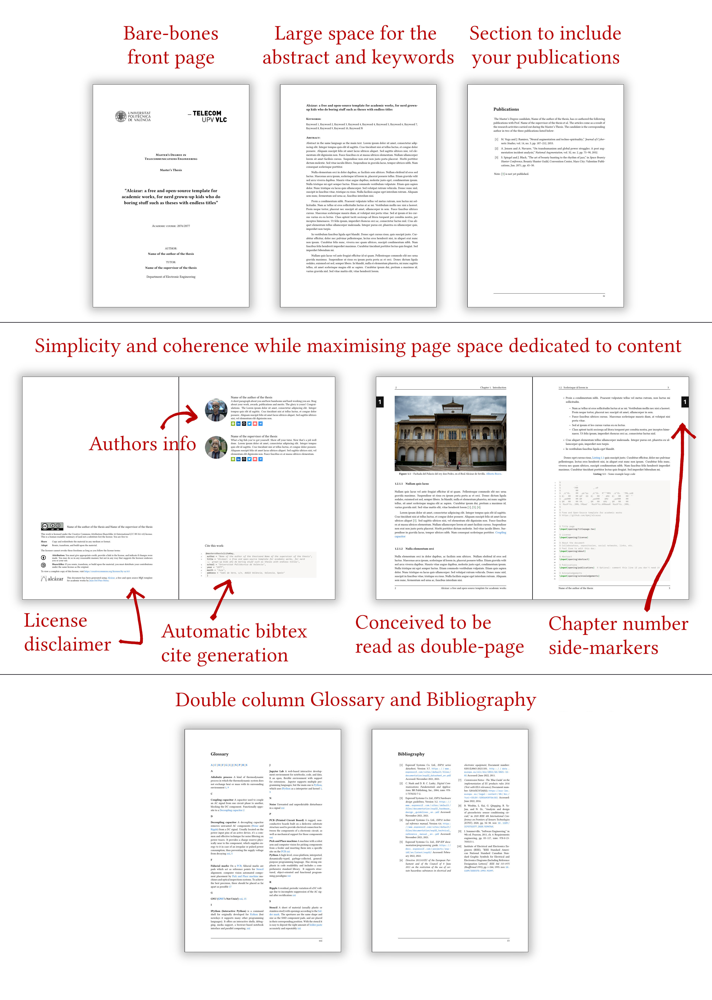

<p align="center">

</p>

<p align="center">
<b>A free and Open-Source template for academic works</b>
</p>

<p align="center">

</p>


<p align="center"><b>
<a href="https://raw.githubusercontent.com/dpmj/alcazar/main/main.pdf">See PDF Preview</a></b>
</p>


## Philosophy

- KISS.
- Easy to use.
- Organized, elegant, coherent and consistent.
- Compact, but not crowded.
- Compatible with `pdflatex`.
- No strange packages.


## Features

<p align="center">

</p>


## Requirements

- `biber` for the multi-bibliography support of `biblatex`. Also, it's nice.
- `python 3` for the `minted` package.


## Build

You can build it with your favorite LaTeX frontend.


### Overleaf

Works out-of the box, no need to configure anything. Simply download this repo as `.zip` and then upload the archive to Overleaf as a new project.


### LaTeX Workshop extension for VS Code / Codium

If you are using the LaTeX Workshop extension by James Yu, you need to add the following tools to your configuration file, under `latex-workshop.latex.tools` (In the UI, navigate to *Latex-workshop > Latex: Recipes > Edit in settings.json*): 

```json
{
    "name": "biber",
    "command": "biber",
    "args": [
        "%DOC%"
    ],
},
{
    "name": "makeglossaries",
    "command": "makeglossaries",
    "args": [
        "%DOCFILE%"
    ],
}
```

Also, edit the `pdflatex` entry as follows to include the `-shell-escape` argument, necessary for the `minted` package.

```json
{
    "name": "pdflatex",
    "command": "pdflatex",
    "args": [
        "-shell-escape",
        "-synctex=1",
        "-interaction=nonstopmode",
        "-file-line-error",
        "%DOC%"
    ],
    "env": {}
}
```

Now add a new recipe, under `latex-workshop.latex.recipes` (In the UI: *Latex-workshop > Latex: Tools > Edit in settings.json*): : 

```json
{
    "name": "alcazar",
    "tools": [
        "pdflatex",
        "makeglossaries",
        "biber",
        "pdflatex",
        "pdflatex"
    ]
}
```

And run the `alcazar` recipe while on a `.tex` file from the project. 

**Note:** If you constantly encounter a `makeglossaries` error saying that `main.aux` could not be found, set to `false` the setting `latex-workshop.latex.autoBuild.cleanAndRetry.enabled` (In the UI, unmark *"Latex-workshop > Latex > Auto build > Clean and retry: Enabled"*)


### Console

This project can easily be built by using the following commands with these recommended parameters. As before, `-shell-escape` flag is needed for the `minted` package.

```bash
$ pdflatex -shell-escape -synctex=1 -interaction=nonstopmode -file-line-error main
$ biber main
$ makeglossaries main
$ pdflatex -shell-escape -synctex=1 -interaction=nonstopmode -file-line-error main
$ pdflatex -shell-escape -synctex=1 -interaction=nonstopmode -file-line-error main
```


## Usage

The file structure of Alcázar is simple and self-explanatory:

```
./
├── bibliography/               # BIBLIOGRAPHY
|   ├── bibliography.tex        # Bibliography generation
|   └── references.bib          # BibTeX references
|
├── figures/                    # Put your figures here
|
├── glossary/                   # GLOSSARY
|   ├── glossary.sty            # Glossary definitions
|   └── glossary.tex            # Glossary generation
|
├── opening/                    # OPENING
|   ├── resources/              # Graphics used in the opening (logos, etc)
|   |
|   ├── about.tex               # Details about the authors
|   ├── abstract.tex            # Abstract, in various languages
|   ├── acknowledgements.tex    # Acknowledgements
|   ├── dedication.tex          # Dedication
|   ├── opening.tex             # Structures the opening part of the document
|   └── publications.tex        # Your publications. Optional, comment line in opening.tex
|   └── titlepage.tex           # Title page
|
├── style/                      # STYLE
|   ├── alcazar.sty             # Style definition and configuration
|   ├── colors.sty              # Colors definition
|   └── pkgs.sty                # Only used to import packages
|
├── text/                       # TEXT
|   ├── appendix/               # Put your addendum here
|   |   ├── appendix.tex        # Appendix generation
|   |   └── thanks.tex          # Say thanks. Optional, comment line in main.tex
|   |
|   └── chapters/               # Put your chapters here
|
└── main.tex                    # The main document.
```

- In `main.tex` you will find some variable definitions, fill them in according to your thesis and the document will update all occurrences automatically.
- Fill in your details about the authors in the file `opening/about.tex`.


## License
    
This work is licensed under a
[Creative Commons Attribution-ShareAlike 4.0 International License](http://creativecommons.org/licenses/by-sa/4.0/).


## Disclaimer

This work is unrelated to any institution, and the references, logos and the like are merely an example of usage.


## To-Do

- [x] Opening
    - [x] Cover
    - [x] About the document
    - [x] Abstract and keywords
    - [x] Publications
    - [x] Acknowledgements
    - [x] Dedication
    - [x] Tables of contents
    - [x] Glossary
        - [x] Example Entries
- [x] Chapters
    - [x] Example Text
    - [x] Example Figures
    - [x] Example Tables
    - [x] Example Listings
- [x] Bibliography
    - [x] Example Citations
- [x] Addendum
    - [x] Example Text
    - [x] Thanks


## Style 

- [x] Compress space used by citations (small, double column)
- [x] Compress space used by glossary (small, double column)
- [x] Choose default serif font - Libertinus
- [x] Choose default sans-serif font - Open Sans (unused for now)
- [x] Choose default monospace font - IBM Plex Mono
- [x] Default font size: 11pt
- [x] Page size: A4 paper
- [x] Simple and compact chapter title style 
- [x] Chapter number marker on the side margins
- [x] Check footnote style
- [ ] Change style of paragraph and subparagraph


    
## Fixes

- [ ] Inconsistent skips above and below floats, too much space sometimes.
- [ ] Inconsistent skips above and below titles sometimes
- [ ] In listings, for some reason the comments of lots of `%` are bugged.


