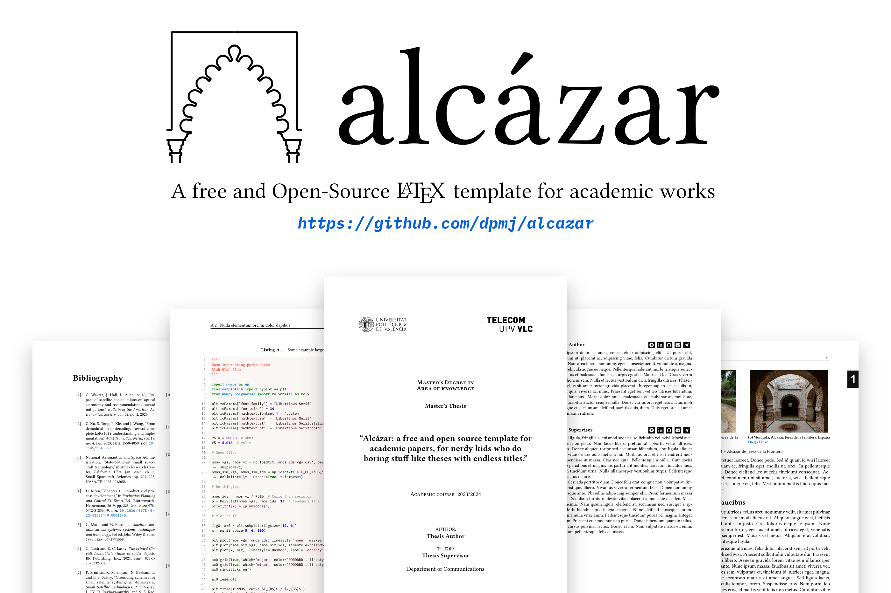
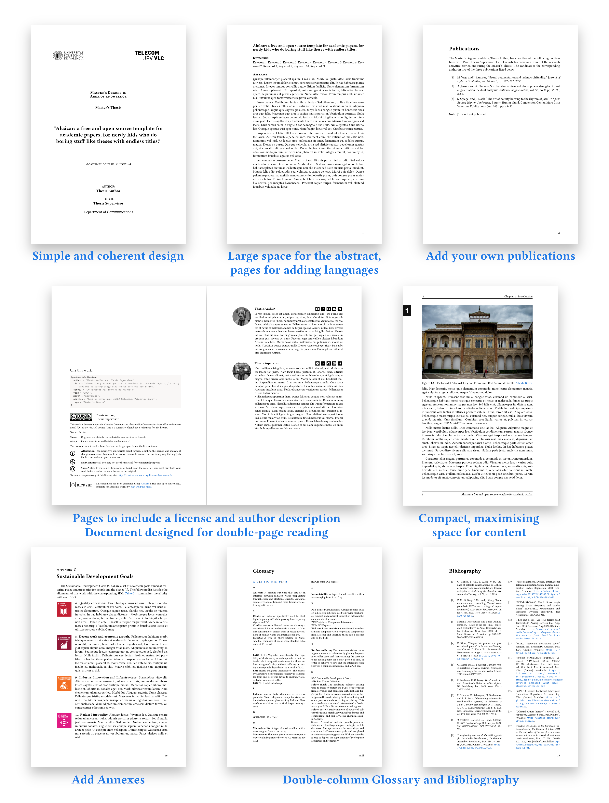

<p align="center">

</p>

<p align="center"><b>
<a href="https://raw.githubusercontent.com/dpmj/alcazar/main/main.pdf">See PDF Preview</a></b>
</p>

<p align="center">
<a href='https://ko-fi.com/dpmjuan' target='_blank'></a>
</p>

## Philosophy

- KISS.
- Easy to use.
- Organized, elegant, coherent and consistent.
- Compact, but not crowded.
- Compatible with `latexmk` and `pdflatex`
- No exotic or discontinued packages.

## Features

<p align="center">

</p>

- A page to include information about the authors.
- A page to include a license.
- Automatic generation of a bibtex cite.
- *"Executive overview"* page (sometimes required in University Degrees adhered to ABET).
- A page to cite your own papers as a result of the project.
- An acknowledgements page and a dedication page. 
- Automatic Table of Contents (ToC), List of Figures (LoF) and List of Tables (LoT).
- Two-column bibliography and glossary.
- Support for appendices. 
- Templates for the Sustainable Development Goals (SDGs) are included in Appendix C if required.

## Customisation

- Details about you and your work are defined in `main.tex'. Fill it in according to your thesis. The document will automatically update all occurrences, including a copy-and-paste-ready bibtex citation! 
- The title page can be easily configured by editing `opening/titlepage.tex`. Include here your faculty's logos.
- Fill in information about the authors in `opening/about.tex`. You can include here a photography of the authors.
- Edit `opening/acknowledgements.tex` and `opening/dedication.tex` as you like!
- Include your abstract (in one or more languages) in `opening/abstract.tex`.
- Chapter and appendix numbers on the page margins can be problematic for printing. They can be disabled by commenting/uncommenting a few lines of code in `style/alcazar.sty`, under the `\fancypagestyle{chapters}` and `\fancypagestyle{addenda}` styles.

### Fonts

The default font is *[Libertinus Serif](https://tug.org/FontCatalogue/libertinusserif/)* plus *[Libertinus Sans](https://tug.org/FontCatalogue/libertinussans/)*.

You can change this in `style/pkgs.sty`. Other high quality options I recommend are *[Source Serif Pro](https://tug.org/FontCatalogue/sourceserifproregular/)* plus *[Source Sans Pro](https://tug.org/FontCatalogue/sourcesanspro/)*. 
The template handles well a Sans-Serif font as base font of the whole document, with *Source Sans Pro* and *[Inter](https://tug.org/FontCatalogue/interregular/)* being two good options. 

The default monospace font is *[IBM Plex Mono]()*. Equally good alternatives are *[Fira Mono]()* and *[Inconsolata](https://tug.org/FontCatalogue/inconsolata/)*.

All these options appear as commented lines in `style/pkgs.sty`, with the correct font scale and options already prepared.

## Build

### Using Overleaf

Download this repo as a `.zip` file, then upload the file to Overleaf as a new project. It should work out of the box.

### Manually

#### Important information

This project can be built with `latexmk` or `pdflatex`, although **I greatly encourage the use of `latexmk`.** Below are examples of compilation commands with some recommended arguments. The `-shell-escape` flag is required for the `minted` package. With `latexmk` both `biber` and `makeglossaries` should run automatically.

A `Makefile` is already included, which invokes `latexmk`. To compile, simply run `make` in the project's root directory. Run `make clean` to remove all auxiliary files. 

Requirements:
 
- `biber` for `biblatex`, 
- `python 3` and `pygments` for the `minted` package.

This template has been confirmed as working on both Linux (TeX Live) and Windows (MiKTeX).

#### With `latexmk`

This project does not need a `latexmkrc` file.

```bash
latexmk -shell-escape -synctex=1 -interaction=nonstopmode -file-line-error -pdf main    
```

#### With `pdflatex`

Run:
```bash
pdflatex -shell-escape -synctex=1 -interaction=nonstopmode -file-line-error main
biber main
makeglossaries main
pdflatex -shell-escape -synctex=1 -interaction=nonstopmode -file-line-error main
pdflatex -shell-escape -synctex=1 -interaction=nonstopmode -file-line-error main
```
Sometimes an additional call to `pdflatex` may be necessary.


### Using the LaTeX Workshop extension for Visual Studio Code / Codium by James Yu 

**Recipes and tools for the `latexmk` and `pdflatex` recipes are already provided in `.vscode/settings.json`. Alcázar should compile out of the box with the default `latexmk` recipe.** 

Manual configuration is described below, if needed:

#### `latexmk` recipe

Works with the default `latexmk` recipe out of the box. These settings are recommeded:

```json
"latex-workshop.latex.autoBuild.run": "never",
"latex-workshop.intellisense.citation.backend": "biblatex",
"latex-workshop.latex.outDir": "%DIR%",
```

#### Creating a new `pdflatex` recipe

To compile using `biber` and `makeglossaries` with `pdflatex` you need to add the following tools to your `.vscode/settings.json` configuration file, under the section `latex-workshop.latex.tools` (In the UI, navigate to *Latex-workshop > Latex: Recipes > Edit in settings.json*): 
```json
{
    "name": "biber",
    "command": "biber",
    "args": [
        "%DOC%"
    ],
},
{
    "name": "makeglossaries",
    "command": "makeglossaries",
    "args": [
        "%DOCFILE%"
    ],
}
```
Edit the `pdflatex` entry as follows to include the `-shell-escape` argument:
```json
{
    "name": "pdflatex",
    "command": "pdflatex",
    "args": [
        "-shell-escape",
        "-synctex=1",
        "-interaction=nonstopmode",
        "-file-line-error",
        "%DOC%"
    ],
    "env": {}
}
```
Now add a new recipe, under `latex-workshop.latex.recipes` (to generate the configuration section from the UI, go to *Latex-workshop > Latex: Tools > Edit in settings.json*):
```json
{
    "name": "alcazar",
    "tools": [
        "pdflatex",
        "makeglossaries",
        "biber",
        "pdflatex",
        "pdflatex"
    ]
}
```
And run the `alcazar` recipe. 

**Note:** If you keep getting a `makeglossaries` error saying that `main.aux` could not be found, set the `latex-workshop.latex.autoBuild.cleanAndRetry.enabled` setting to `false` (in the UI, uncheck *"Latex-workshop > Latex > AutoBuild > Clean and retry: Enabled"*)

## Template file structure

The file structure of Alcázar is simple and self-explanatory:
```
./
├── bibliography/               # BIBLIOGRAPHY
|   ├── bibliography.tex        # Bibliography generation
|   └── references.bib          # BibTeX references
|
├── figures/                    # Put your figures here
|
├── glossary/                   # GLOSSARY
|   ├── glossary.sty            # Glossary definitions
|   └── glossary.tex            # Glossary generation
|
├── opening/                    # OPENING
|   ├── resources/              # Graphics used in the opening (logos, etc)
|   |
|   ├── about.tex               # Details about the authors
|   ├── abstract.tex            # Abstract, in various languages
|   ├── acknowledgements.tex    # Acknowledgements
|   ├── dedication.tex          # Dedication
|   ├── opening.tex             # Structures the opening part of the document
|   └── publications.tex        # Your publications. Optional, comment line in opening.tex
|   └── titlepage.tex           # Title page
|
├── style/                      # STYLE
|   ├── alcazar.sty             # Style definition and configuration
|   ├── colors.sty              # Colors definition
|   └── pkgs.sty                # Only used to import packages
|
├── text/                       # TEXT
|   ├── appendix/               # Put your addendum here
|   |   ├── appendix.tex        # Appendix generation
|   |   └── thanks.tex          # Say thanks. Optional, comment line in main.tex
|   |
|   └── chapters/               # Put your chapters here
|
└── main.tex                    # The main document.
```

## Thanks!

Alcázar was born as a personal project to replace the poor quality report templates I encountered throughout my academic life. It continued to grow until it made sense to create a comprehensive template. I have learned a lot during the development of Alcázar.

Thanks to my friends and colleagues who beta-tested Alcázar. You found many bugs, made excellent suggestions and inspired me a lot.

And to all the people who have already used Alcázar, I hope I have helped you despite my questionable LaTeX skills!

If you enjoy Alcázar, you can buy me a coffee on Ko-Fi! :)

<a href='https://ko-fi.com/dpmjuan' target='_blank'></a>


## Credits / citation

If you use and like this template, please consider giving credit :) This is completely optional, of course ;)

There is already a small acknowledgement text in `opening/license.tex` below the document license. 

```bibtex
@misc{alcazar-latex-template,
  author = {Del Pino Mena, Juan},
  title = {Alcazar: A free and Open-Source LaTeX template for academic works},
  url = {https://github.com/dpmj/alcazar},
  doi = {10.5281/zenodo.13935260}
}
```

## License
    
This work is licensed under a
[Creative Commons Attribution-NonCommercial-ShareAlike 4.0 International License](http://creativecommons.org/licenses/by-nc-sa/4.0/).

This licence only applies to derivatives of the template itself. You can licence your reports created using this template however you wish, although I would encourage you to use a Creative Commons licence.

## Disclaimer

This work is not affiliated with any institution, and the references, logos, and the like are merely examples of usage. All third-party resources included in this repository are the property of their respective owners and are provided for convenience only.
